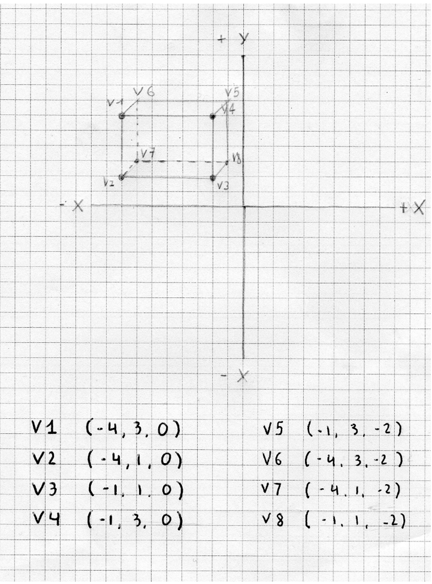
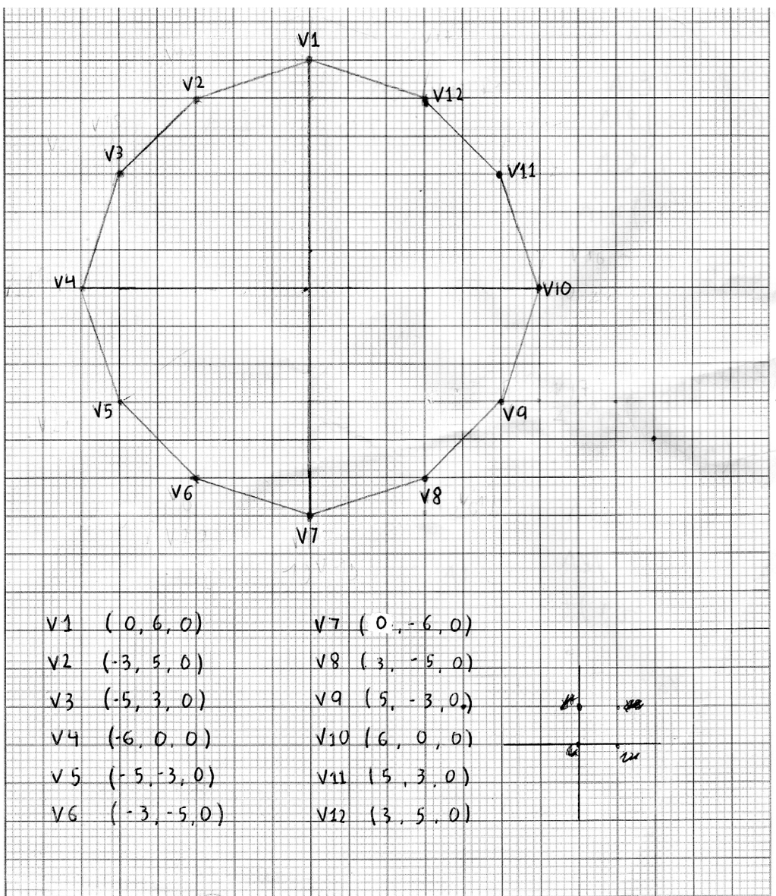
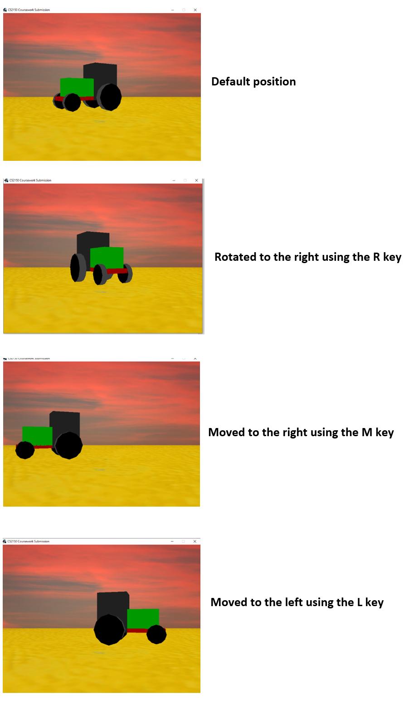

# Tractor-Animation-OpenGL
This is an animation script that allows to move a tractor created using OpenGL in Java 
The user can use the following keys to move the tractor:
R – To rotate the tractor anti-clockwise
T- To rotate the tractor clockwise
M- To move the tractor to the right 
L -  To move the tractor to the left 
Space -  To reset the initial Position 
To create the tractor 2 shapes a cuboid and a dodecagon have been used. 
These are the coordinates used to create the cuboid.

The dodecagon has been desgined in a 2 dimensional grid as to make in make 3 dimensional simply change the Z value from 0 to -1.

Screenshots:

